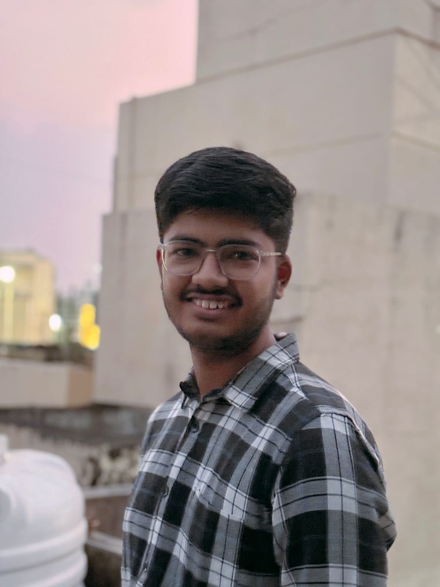

# sumedh-kulkarni-portfolio
Personal digital portfolio showcasing my engineering projects, CAD skills, and more.
<!DOCTYPE html>
<html lang="en">
<head>
  <meta charset="UTF-8" />
  <meta name="viewport" content="width=device-width, initial-scale=1.0"/>
  <title>Sumedh Kulkarni | Portfolio</title>
  <link href="https://fonts.googleapis.com/css2?family=Poppins:wght@300;500;700&display=swap" rel="stylesheet" />
  
</head>
<body>

<header>
  <h1>Hi, I'm Sumedh Kulkarni</h1>
  
Welcome to my Digital Portfolio. I am a Mechanical Engineering Student | CAD & Programming Enthusiast

</header>

  

  <section>
    <h2>About Me</h2>
    
Hello! I'm Sumedh Kulkarni, a passionate, curious and motivated first-year BTech Mechanical Engineering student with a strong foundation in CAD tools and programming languages. I love building innovative designs and writing efficient code. I enjoy learning new things and bringing ideas to life through creative problem solving and hands-on projects. My digital portfolio showcases the work I have done in areas like CAD models, EV models. I aim to approach every challenge with creativity and precision.

  </section>

  <section>
    <h2>Skills</h2>
    <ul>
      <li>AutoCAD & Fusion 360 (Expert, hands-on experience)</li>
      <li>C, C++, Python, HTML</li>
      <li>Problem-solving and logical thinking</li>
    </ul>
  </section>

  <section>
    <h2>Education</h2>
    <ul>
      <li>BTech in Mechanical Engineering (1st Year)</li>
      <li>12th Grade - 84%</li>
      <li>10th Grade - 88%</li>
    </ul>
  </section>

  <section>
    <h2>Projects</h2>
    <h3>Arduino Robot Car Model</h3>
    
I built an Arduino-powered robot car model that can be controlled wirelessly. It uses ultrasonic sensors for obstacle detection and can follow a path using IR sensors.

    
  </section>

  <section>
    <h2>Contact</h2>
    
Feel free to reach out to me through these platforms:

    

      <a href="https://twitter.com/KSumedh1609" target="_blank">🐦 @KSumedh1609</a>
      <a href="mailto:sumedhk283@gmail.com">✉️ sumedhk283@gmail.com</a>
    

  </section>

<footer>
  © 2025 Sumedh Kulkarni | All rights reserved
</footer>

</body>
</html>
